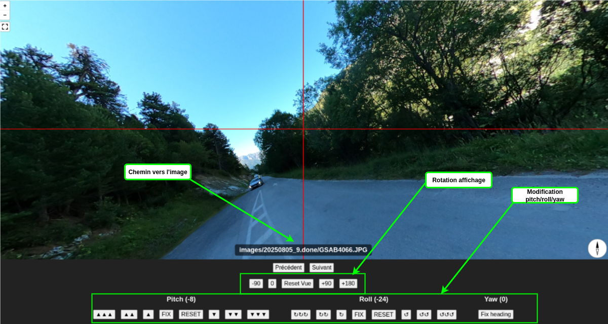

Cet outil permet de corriger rapidement les orientations **Pitch / Roll / Yaw** des photos sphères équirectangulaires.

Les corrections s’appliquent sur les balises EXIF suivantes :
- `XMP-GPano:PoseRollDegrees`
- `XMP-GPano:PosePitchDegrees`
- `XMP-GPano:PoseHeadingDegrees`

---

## Installation

1. **Construire l’image Docker** depuis la racine du dépôt Git :

   ```bash
   docker build -t php8-apache-exiftool .

2. Démarrer le conteneur, en remplaçant [REPERTOIRE_IMAGES] par le chemin vers le dossier contenant les images à traiter.
Les fichiers doivent être accessibles en écriture par l’utilisateur www-data (UID 33).

   ```bash
   docker run --rm -p 5555:80 \
    -v .:/var/www/html/ \
    -v [REPERTOIRE_IMAGES]/:/var/www/html/images/ \
    php8-apache-exiftool

3. Ouvrir l’interface via : http://127.0.0.1:5555

## Utilisation



L’interface est divisée en plusieurs zones :

- **Affichage** : composé d’un repère vertical/horizontal, il permet de visualiser la sphère avec les EXIF actuellement définis.  
- **Contrôles** : permettent de régler l’affichage ainsi que les valeurs de pitch, roll et yaw.

**Boutons principaux :**
- **FIX** : enregistre la position actuelle comme horizon pour l’axe sélectionné.  
- **RESET** : remet à zéro le paramètre EXIF correspondant à l’axe.

## Raccourcis clavier

Des raccourcis clavier facilitent les corrections (clavier **AZERTY**) :

- **A** : verrouiller l’horizon sur le **pitch** visible  
- **Z** : verrouiller l’horizon sur le **roll** visible  
- **E** : verrouiller la direction sur le **yaw** visible  
- **Q** : rotation gauche de **90°**  
- **S** : rotation à **0°**  
- **D** : rotation droite de **90°**  
- **W** : image précédente  
- **X** : affichage de la vue par défaut (selon les EXIF)  
- **C** : image suivante  

## Notes

- Les modifications écrivent directement dans les métadonnées EXIF des fichiers.  
- Il est recommandé de **sauvegarder vos images originales** avant traitement.  
