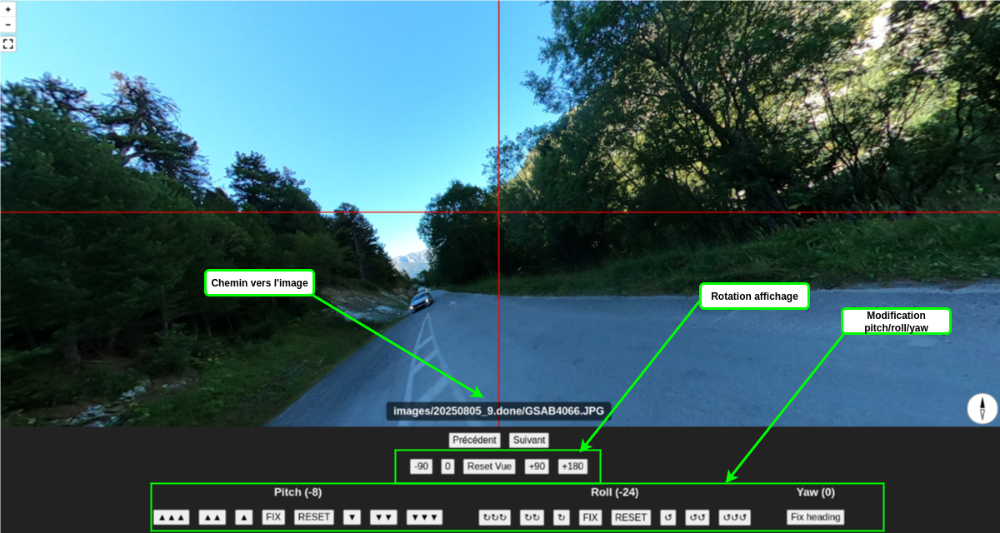

# Pan360 FixExif

Application web 100 % JavaScript (statique, hébergeable sur GitHub Pages) pour corriger en **WYSIWYG**
l'orientation **Pitch / Roll / Yaw** de vos photos 360° publiées sur [Panoramax](https://panoramax.fr).

Les corrections sont visibles en direct dans la visionneuse puis envoyées à l'API Panoramax
(`PATCH /api/collections/{collection}/items/{photo}` avec `pitch`, `roll`, `yaw`),
ce qui met à jour les métadonnées `pers:pitch`, `pers:roll`, `pers:yaw`.

## Mise en ligne sur GitHub Pages

1. Dans le dépôt GitHub : **Settings → Pages**.
2. *Source* : **Deploy from a branch**, branche `main`, dossier `/ (root)`.
3. L'application est servie sur `https://<utilisateur>.github.io/pan360-fixexif/`.

Aucun build n'est nécessaire. En local, n'importe quel serveur statique convient :

```bash
python3 -m http.server 5555   # puis http://127.0.0.1:5555
```

## Utilisation



1. Ouvrir les **paramètres ⚙** et renseigner :
   - l'**instance** Panoramax (par défaut `https://panoramax.openstreetmap.fr`) ;
   - votre **token** Panoramax (nécessaire pour enregistrer et pour « Mes séquences »).
     Cochez « Mémoriser » pour le conserver dans le `localStorage` du navigateur,
     sinon il est oublié à la fermeture de l'onglet.
2. Coller l'URL d'une séquence (page Panoramax contenant `seq=…`, URL d'API
   `…/api/collections/<id>/items`, ou simplement l'identifiant) puis **Charger** —
   ou choisir une séquence via **Mes séquences**.
3. Corriger chaque photo :
   - **Pitch** : regarder vers l'avant (yaw 0°) ou l'arrière, monter/descendre la vue pour poser
     l'horizon sur la ligne rouge, puis **FIX**.
   - **Roll** : même chose en regardant à gauche (-90°) ou à droite (+90°), puis **FIX**.
   - **Yaw** : orienter la vue dans la direction voulue puis **Fix heading**.
   - Les boutons ▲/▼, ↻/↺ et les curseurs permettent un réglage fin ; **RESET** remet l'axe à 0.
4. **Synchroniser vers Panoramax** envoie toutes les photos modifiées
   (ou **Enregistrer cette photo** pour la photo courante uniquement).

Les modifications non synchronisées sont conservées dans le navigateur : vous pouvez fermer
l'onglet et reprendre plus tard. L'URL (`#seq=…&img=…`) permet de revenir directement à une photo.
Le bouton « Effacer mes données locales » des paramètres supprime token, réglages et modifications en attente.

## Raccourcis clavier

Les raccourcis sont liés à la position physique des touches (libellés ci-dessous en **AZERTY** ;
l'aide intégrée affiche les touches de votre clavier quand le navigateur le permet) :

| Touche | Action |
|---|---|
| **A** | FIX pitch sur l'horizon visible |
| **Z** | FIX roll sur l'horizon visible |
| **E** | Fix heading (yaw) sur la direction visible |
| **Q** / **S** / **D** / **F** | Vue à -90° / 0° / +90° / 180° |
| **W** / **C** (ou PgUp / PgDn) | Image précédente / suivante |
| **X** | Vue par défaut (selon le yaw) |
| **V** | Synchroniser vers Panoramax |
| **← →** / **↑ ↓** | Tourner / incliner la vue |

## Notes

- Seul le propriétaire des photos (ou un administrateur) peut les modifier sur Panoramax.
- Le token est stocké en clair dans le stockage local de votre navigateur et n'est envoyé qu'à
  l'instance configurée. N'utilisez pas l'option « Mémoriser » sur un ordinateur partagé.
